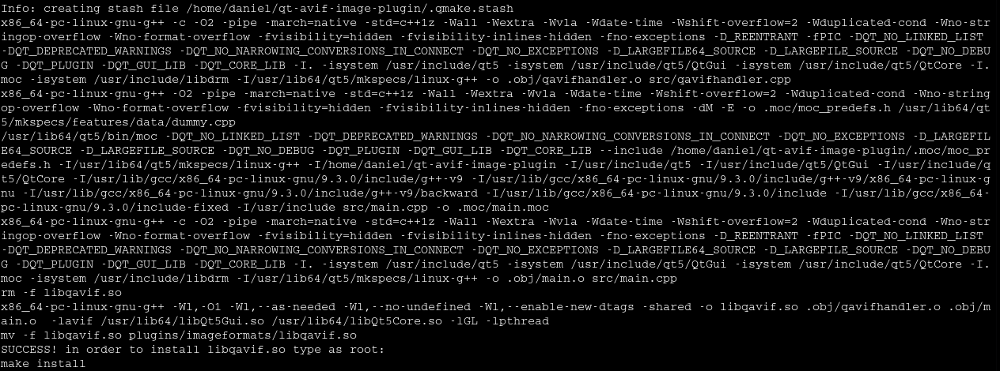
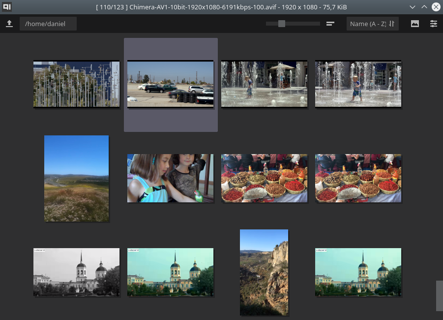

# qt-avif-image-plugin
Qt plug-in to allow Qt and KDE based applications to read/write AVIF images.

Manual **How to install AVIF support in KDE**

## What is AVIF?

**AV**1 **I**mage File **F**ormat (AVIF) is an advanced image format [specified](https://aomediacodec.github.io/av1-avif/) by [Alliance for Open Media](https://aomedia.org/).

AVIF is technically a picture compressed with AV1 video codec wrapped in ISO Base Media File Format.  
AV1 compression provides significantly better efficiency than traditional JPEG. Beside 8bit per channel AVIF allows 10bit and 12bit depth, transparency, color profiles, metadata, animation, compression quality ranging from visually lossless to highly compressed lossy while maintaining decent visual quality at low bitrates.

## 1) Download

Download [Latest Release](https://github.com/novomesk/qt-avif-image-plugin/releases/latest) and extract the content of the zip file:

`unzip qt-avif-image-plugin-0.4.5.zip`

**Recommended**: read [README.txt](README.txt)

## 2) Adding MIME type

If you have _shared-mime-info 2.0_ or newer installed, you may skip this step. AVIF MIME type are installed already.

In order to install mime type **image/avif** in your system, copy (as root) _qt-avif-image-plugin.xml_ file to _/usr/share/mime/packages/_ folder and run:

`update-mime-database /usr/share/mime`


## 3) Compile Qt Image Plugin

Qt Image Plugin allows Qt and KDE applications to open/save pictures in AVIF format. The plug-in uses [libavif](https://github.com/AOMediaCodec/libavif/) internally.  
You need Qt5 development packages (for example qtbase5-dev), qmake, you may also need cmake and yasm.

If your system has libavif installed (version 0.8.2 or newer, check for the presence of _/usr/include/avif/avif.h_), run:

`./build_libqavif_dynamic.sh` 


If you don't have libavif installed, run:

`./build_libqavif_static.sh` 


### Alternative way of building using cmake

This alternative requires *extra-cmake-modules*

```
mkdir build
cd build
cmake ..
make
```

### Windows builds

#### MSYS2 platform

Use same steps like building under Linux.

#### Microsoft Visual Studio + Qt Creator

You need to prepare **libaom.a** and **libavif.a** before opening qt-avif-image-plugin_local-libavif.pro in Qt Creator.

##### Prepare libaom.a

Create folder `ext\libavif\ext\aom\build.libavif\` and change to this folder.

Run `C:\Qt\Tools\CMake_64\bin\cmake.exe -G "Visual Studio 16 2019" -DCMAKE_BUILD_TYPE=Release -DENABLE_DOCS=0 -DENABLE_EXAMPLES=0 -DENABLE_TESTDATA=0 -DENABLE_TESTS=0 -DENABLE_TOOLS=0 -DCONFIG_PIC=1 ..`

cmake should create project files for Visual Studio. Now you can open *AOM.sln*

Go to *Configuration Manager...* and change (if necessary) *Active solution configuration* from Debug to Release.

Build Solution

Copy and rename `ext\libavif\ext\aom\build.libavif\Release\aom.lib` to `ext\libavif\ext\aom\build.libavif\libaom.a`

##### Prepare libavif.a

Create folder `ext\libavif\build\` and change to this folder.

Run `C:\Qt\Tools\CMake_64\bin\cmake.exe -G "Visual Studio 16 2019" -DCMAKE_BUILD_TYPE=Release -DBUILD_SHARED_LIBS=OFF -DAVIF_CODEC_AOM=ON -DAVIF_LOCAL_AOM=ON ..`

cmake should create project files for Visual Studio. Now you can open *libavif.sln*

Go to *Configuration Manager...* and change (if necessary) *Active solution configuration* from Debug to Release.

Build Solution

Copy and rename `ext\libavif\build\Release\avif.lib` to `ext\libavif\build\libavif.a`

##### Open qt-avif-image-plugin_local-libavif.pro in Qt Creator

Build Project qt-avif-image-plugin_local-libavif


Plug-in is ready in `plugins\imageformats\qavif.dll`

## 4) Install libqavif.so

Copy **libqavif.so** to a folder where _qt5-image-formats-plugins_ and/or _kimageformats_ are installed. It could be one of these locations:

*   /usr/lib/qt5/plugins/imageformats
*   /usr/lib/qt/plugins/imageformats/
*   /usr/lib/x86_64-linux-gnu/qt5/plugins/imageformats


## 5) Associate *.avif with applications

Qt based applications should be able to open [AVIF](https://github.com/AOMediaCodec/av1-avif/tree/master/testFiles) images now.  
Example how to associate AVIF file type with _gwenview_:  


## 6) Enable AVIF thumbnails in dolphin file manager

Copy _avif.desktop_, _avifs.desktop_ to:  
*/usr/share/kservices5/qimageioplugins/*

Update _imagethumbnail.desktop_ (in /usr/share/kservices5/ ):  
Add `;image/avif` to the `MimeType=` list:


AVIF thumbnails in dolphin:  


## 7) Enjoy using AVIF in applications

### gwenview


### KolourPaint


### nomacs


### KPhotoAlbum


### digiKam


### qView


### LXImage-Qt


### qimgv



### PhotoQt


### Kanryu QuickViewer


### VookiImageViewer


### YACReader


