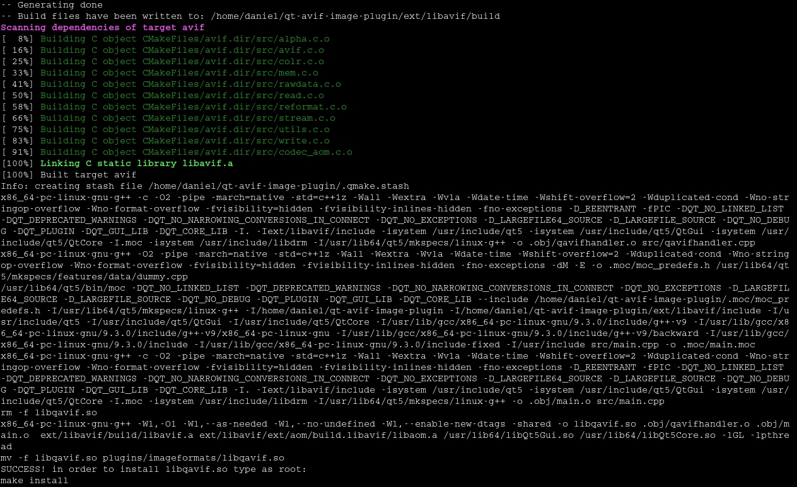
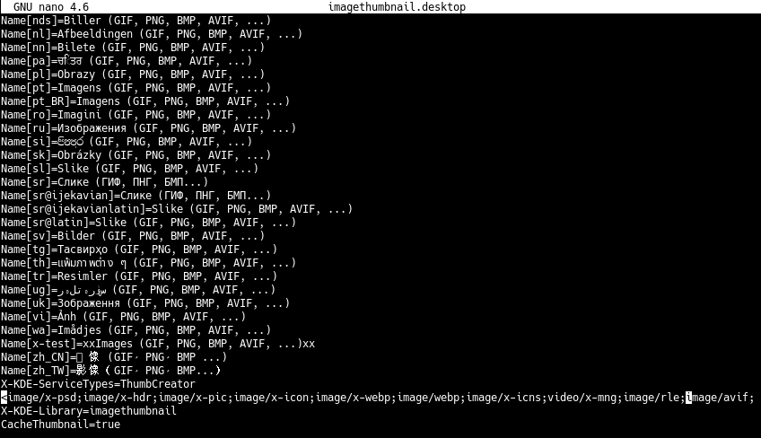

# qt-avif-image-plugin
Qt plug-in to allow Qt and KDE based applications to read/write AVIF images.

Manual **How to install AVIF support in KDE**

## What is AVIF?

**AV**1 **I**mage File **F**ormat (AVIF) is an advanced image format [specified](https://aomediacodec.github.io/av1-avif/) by [Alliance for Open Media](https://aomedia.org/).

AVIF is technically a picture compressed with AV1 video codec wrapped in ISO Base Media File Format.  
AV1 compression provides significantly better efficiency than traditional JPEG. Beside 8bit per channel AVIF allows 10bit and 12bit depth, transparency, color profiles, metadata, animation, compression quality ranging from visually lossless to highly compressed lossy while maintaining decent visual quality at low bitrates.

## 1) Download

Download [Latest Release](https://github.com/novomesk/qt-avif-image-plugin/releases/latest) and extract the content of the zip file:

`unzip v0.1.0.zip`

**Recommended**: read [README.txt](README.txt)

## 2) Adding MIME types

In order to install mime types **image/avif** and **image/avif-sequence** in your system, copy (as root) _avif.xml_, _avifs.xml_ files to _/usr/share/mime/packages/_ folder and run:

`update-mime-database /usr/share/mime`

  

## 3) Compile Qt Image Plugin

Qt Image Plugin allows Qt and KDE applications to open/save pictures in AVIF format. The plug-in uses [libavif](https://github.com/AOMediaCodec/libavif/) internally.  
You need Qt5 development packages (for example qtbase5-dev), qmake, you may also need cmake and yasm.

If your system has libavif installed (at least version 0.7.0, check for the presence of _/usr/include/avif/avif.h_), run:

`./build_libqavif_dynamic.sh` 

If you don't have libavif installed, run:

`./build_libqavif_static.sh` 

## 4) Install libqavif.so

Copy **libqavif.so** to a folder where _qt5-image-formats-plugins_ and/or _kimageformats_ are installed. It could be one of these locations:

*   /usr/lib/qt5/plugins/imageformats
*   /usr/lib/qt/plugins/imageformats/
*   /usr/lib/x86_64-linux-gnu/qt5/plugins/imageformats

## 5) Associate *.avif with applications

Qt based applications should be able to open [AVIF](https://github.com/AOMediaCodec/av1-avif/tree/master/testFiles) images now.  
Example how to associate AVIF file type with _gwenview_:  

## 6) Enable AVIF thumbnails in dolphin file manager

Copy _avif.desktop_, _avifs.desktop_ to:  
*/usr/share/kservices5/qimageioplugins/*

Update _imagethumbnail.desktop_ (in /usr/share/kservices5/ ):  
Add `;image/avif;image/avif-sequence` to the `MimeType=` list:  

AVIF thumbnails in dolphin:  

## 7) Enjoy using AVIF in applications

### gwenview

### KolourPaint

### nomacs

### KPhotoAlbum

### digiKam

### qView

### LXImage-Qt

